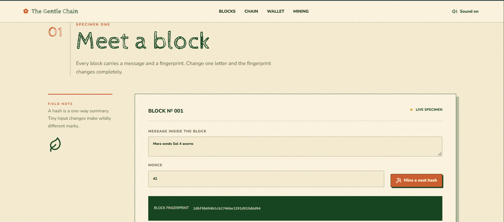
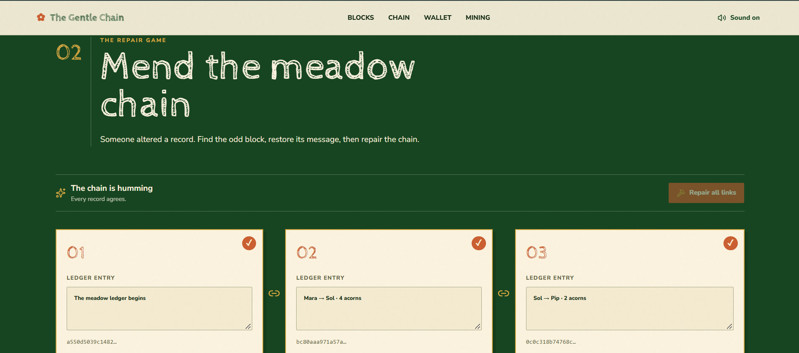
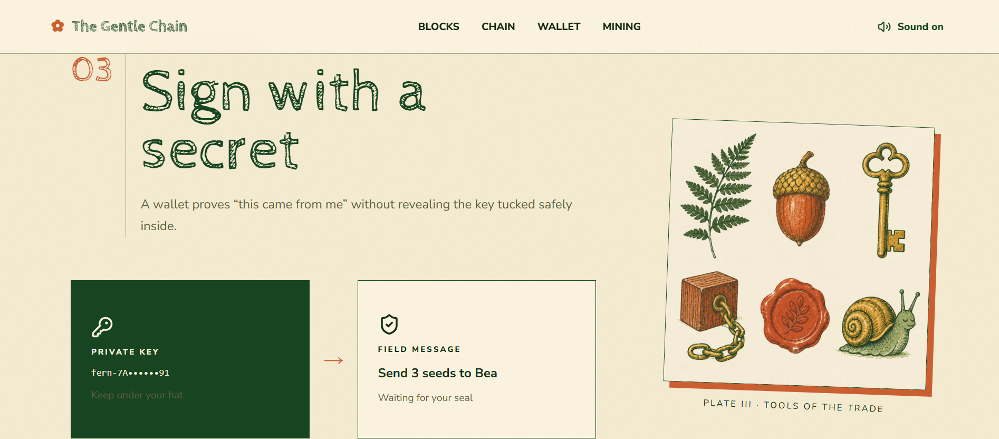
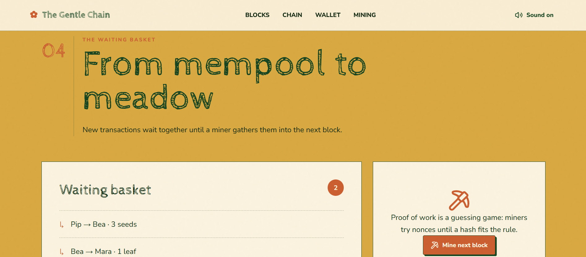
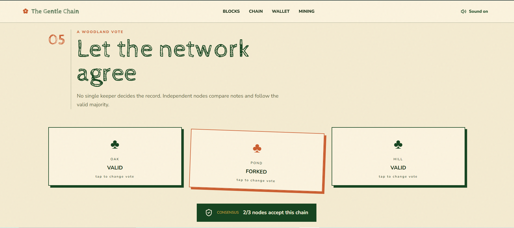

# 🌿 The Gentle Chain

### An Interactive Field Guide to Blockchain Fundamentals

**The Gentle Chain** is an interactive educational web experience that introduces fundamental blockchain concepts through calm, tactile, and story-driven simulations.

Instead of presenting blockchain through complex dashboards, terminal-style interfaces, or crypto-heavy terminology, the project uses a **vintage botanical field-guide aesthetic** to make abstract technical concepts easier to explore and understand.

---

## ✨ What You'll Learn

The project is organized into interactive chapters, with each chapter demonstrating a core blockchain concept through a simple visual experiment.

### 01. Meet a Block — Hashing & Nonce

Experiment with a block's data and observe how even a small change produces a completely different hash.

You can also **mine a neat hash** by searching for a nonce that produces a hash beginning with `0`.

**Concepts:** Cryptographic hashing, avalanche effect, nonce, Proof of Work


---

### 02. Mend the Meadow Chain — Immutability

Explore a chain of connected blocks where each block depends on the hash of the previous one.

Modify the data inside a block and watch the chain become invalid. Repair the links to restore its integrity.

**Concepts:** Hash pointers, chain integrity, tamper detection, immutability


---

### 03. Sign with a Secret — Digital Signatures

Use a private key to create a digital signature represented as a **wax seal**.

The interaction demonstrates how a transaction can be authenticated without exposing the private key itself.

**Concepts:** Asymmetric cryptography, public/private keys, digital signatures


---

### 04. From Mempool to Meadow — Transactions & Mining

Pending transactions wait inside a visual **waiting basket**, representing the mempool.

Mine the next block and watch those transactions move from the pending pool into a newly created block.

**Concepts:** Mempool, pending transactions, block construction, mining


---

### 05. A Woodland Vote — Network Consensus

Interact with three independent nodes — `OAK`, `POND`, and `HILL` — and observe how their validation decisions affect the state of the network.

**Concepts:** Distributed consensus, node agreement, majority-based validation



---

## 🎨 Design Philosophy

The project combines technical education with a deliberately unconventional visual language.

* 🌾 **Vintage Field Guide** — Inspired by botanical journals and meadow diaries
* 🪵 **Tactile Metaphors** — Blocks, wax seals, waiting baskets, and woodland councils represent technical concepts
* 🌿 **Calm Interface** — Warm parchment tones, natural colors, and hand-drawn visual elements
* 🫁 **Mindful UX** — A short breathing interaction provides a deliberate pause during learning

The intention is not to hide the technical concepts, but to give learners a more intuitive way to interact with them.

---

## 🛠️ Tech Stack

| Technology          | Purpose                                   |
| ------------------- | ----------------------------------------- |
| **TanStack Start**  | Full-stack React framework                |
| **React 19**        | User interface                            |
| **TypeScript**      | Type-safe development                     |
| **Tailwind CSS v4** | Styling and responsive design             |
| **Lucide React**    | Interface icons                           |

### Typography

* **Cabin Sketch** — Display typography
* **Nunito Sans** — Body typography

---

## 🚀 Getting Started

### Prerequisites

Make sure you have:

* Node.js 18+ or Bun
* npm or Bun package manager

### Installation

Clone the repository:

```bash
git clone https://github.com/your-username/the-gentle-chain.git
```

Navigate to the project:

```bash
cd the-gentle-chain
```

Install dependencies:

```bash
npm install
```

Or with Bun:

```bash
bun install
```

Start the development server:

```bash
npm run dev
```

Or:

```bash
bun dev
```

Then open the local development URL shown in your terminal.

---

## 🧩 Architecture & Implementation

The project is designed as a lightweight browser-based educational simulation.

### Deterministic Hashing

The block demonstrations use a lightweight deterministic hashing mechanism to provide immediate visual feedback when data changes.

### Responsive Interface

The interface is designed to work across different screen sizes, from mobile displays to wide desktop screens.

### Reduced Motion Support

The experience considers users who prefer reduced motion through the `prefers-reduced-motion` media preference.


---

## 🎯 Why This Project?

Blockchain concepts such as hashing, immutability, digital signatures, mempools, and consensus can feel abstract when presented only through definitions and diagrams.

**The Gentle Chain** takes a different approach:

> **Learn the concept by interacting with it.**

Each chapter turns an abstract mechanism into something that can be changed, observed, broken, and repaired.

---

## 📚 Educational Scope

This project is intended as an **educational visualization**, not a production blockchain implementation.

The simulations simplify real-world blockchain mechanisms so that their underlying ideas can be explored interactively.

---

## 📜 License

This project is released under the **MIT License**.

Feel free to explore, fork, modify, and adapt it for educational purposes.
